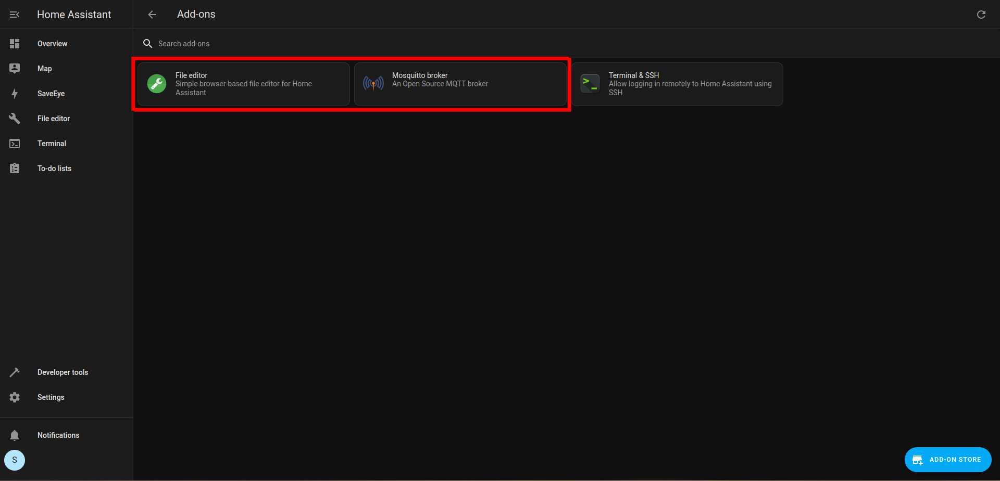
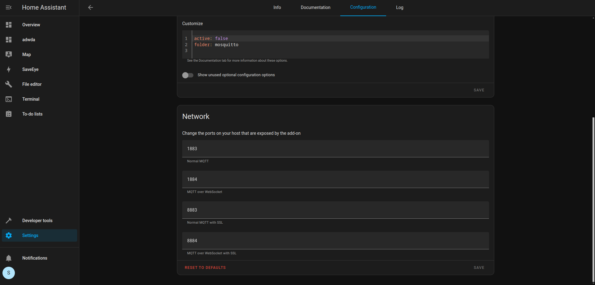
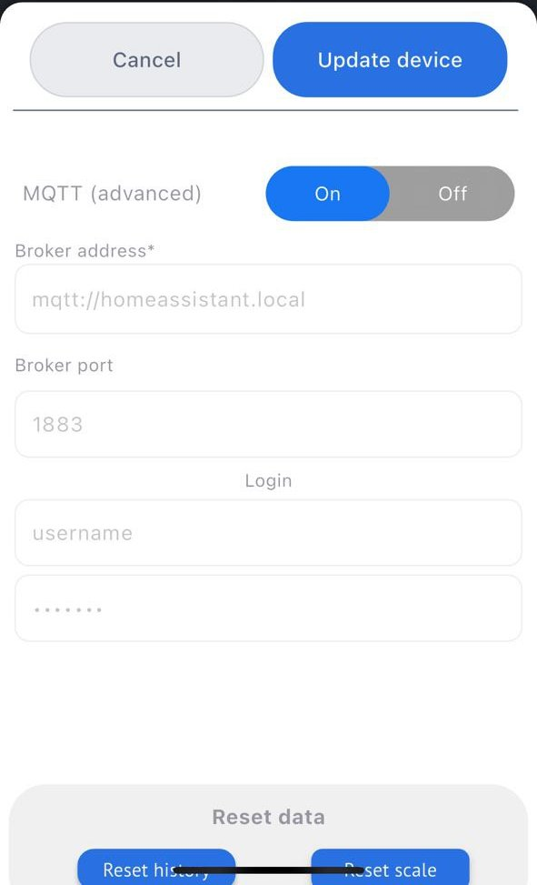
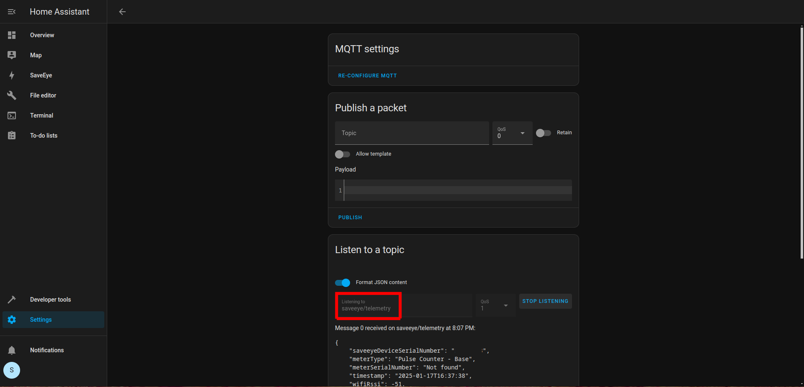
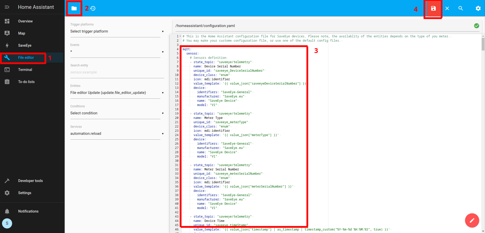
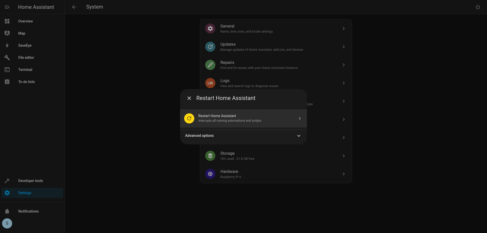

# Home Assistant Guide for SaveEye Devices

This guide explains how to integrate SaveEye devices with Home Assistant using Local MQTT. By following these steps, you can configure your SaveEye device to send data to an MQTT broker and display it on your Home Assistant dashboard.

---

## Table of Contents
1. [Installing the Requirements](#1-installing-the-requirements)
2. [Configuring Mosquitto](#2-configuring-mosquitto)
3. [Setting Up Local MQTT on the Device](#3-setting-up-local-mqtt-on-the-device)
4. [Testing the Connection](#4-testing-the-connection)
5. [Defining Your Device in Home Assistant](#5-defining-your-device-in-home-assistant)
6. [Restarting Home Assistant](#6-restarting-home-assistant)
7. [Adding a Dashboard](#7-adding-a-dashboard)
8. [Additional Notes](#8-additional-notes)

---

## 1. Installing the Requirements

To set up your SaveEye device in Home Assistant, install the following add-ons:
- **Mosquitto broker**
- **File editor**

---

## 2. Configuring Mosquitto

After installing the Mosquitto broker, configure your MQTT settings. You'll then need to use the same configuration into the SaveEye app. Here's how:  
1. Navigate to **Settings > Add-ons > Mosquitto broker > Configuration** in Home Assistant.  
2. Input the appropriate settings that will later be used inside the SaveEye app.  

---

## 3. Setting Up Local MQTT on the Device

To configure MQTT on your SaveEye device:  
1. Open the SaveEye app and navigate to the MQTT configuration settings.  
2. Enter the following information:
   - **Broker URL**: Use `mqtt://homeassistant.local` if your device and Home Assistant are on the same network. Otherwise, input the IP address of your MQTT broker.  
   - **Port**: `1883` (default).  
   - **Username and Password**: Use the credentials configured in the Mosquitto broker.  
3. Save the configuration by clicking **Update device**.  

   > ⚠️ Note: This information will be stored in plain text on the SaveEye server.

---

## 4. Testing the Connection

To check the connection between your SaveEye device and the MQTT broker:  
1. In Home Assistant, go to **Settings > Devices and Services > MQTT > Configure**.  
2. Enter the topic `saveeye/telemetry` and click **START LISTENING**.  
3. (Optional) Enable **Format JSON content** for better readability.  
4. If configured correctly, you should see incoming data from your device.  

---

## 5. Defining Your Device in Home Assistant
To add your SaveEye device to Home Assistant:
1. Open the **File Editor** from the sidebar in Home Assistant.
2. Navigate to `configuration.yaml` (use the folder icon in the editor).
3. Append the necessary configuration for your SaveEye device:
   - You can copy-paste configurations from the provided examples.
   - Alternatively, create your own configurations using the data from `HA-general-config.yml`, which contains all supported parameters for SaveEye devices.  
     > ⚠️ Note: Parameter availability depends on your specific meter type.
4. Save the changes.

### Example Configuration Files:
- [HA-SaveEye-Base.yml](configs/HA-SaveEye-Base.yml): Base-Remote setup.  
- [HA-general-config.yml](configs/HA-general-config.yml): Contains all supported parameters.  

---

## 6. Restarting Home Assistant

To apply the new configurations:  
1. Navigate to **Settings > System** in Home Assistant.  
2. Click the **Power button** and select **Restart**.  

---

## 7. Adding a Dashboard

You're all set! Your SaveEye device should now be integrated with Home Assistant and ready to display telemetry data. 

To create a dashboard:
1. Navigate to **Settings > Dashboards**.
2. Select **ADD DASHBOARD** and configure a default dashboard.
3. Once complete, you'll have access to all the reading parameters from your SaveEye device.

---
